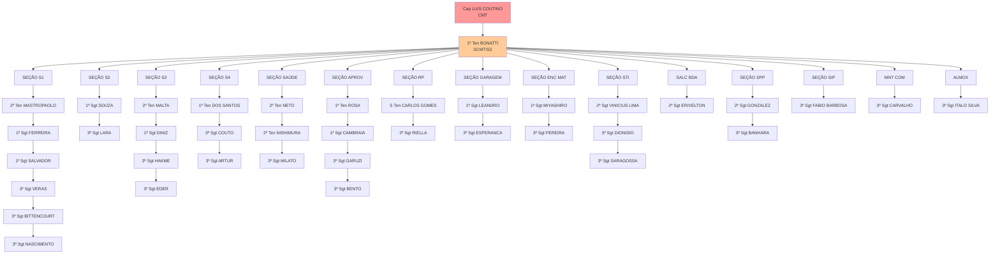

# Organograma da 2ª Cia Com Mec

Representação estruturada da hierarquia e seções da 2ª Companhia de Comunicação Mecanizada.

```mermaid
graph TB
    CMT[Cap LUIS COUTINO<br/>CMT]
    CMT --> SCMT[1º Ten BONATTI<br/>SCMT/S2]
    
    SCMT --> S1[SEÇÃO S1]
    SCMT --> S2[SEÇÃO S2]
    SCMT --> S3[SEÇÃO S3]
    SCMT --> S4[SEÇÃO S4]
    SCMT --> SAUDE[SEÇÃO SAÚDE]
    SCMT --> APROV[SEÇÃO APROV]
    SCMT --> RP[SEÇÃO RP]
    SCMT --> GARAGEM[SEÇÃO GARAGEM]
    SCMT --> ENCMAT[SEÇÃO ENC MAT]
    SCMT --> STI[SEÇÃO STI]
    SCMT --> SALCBDA[SALC BDA]
    SCMT --> SPP[SEÇÃO SPP]
    SCMT --> SIP[SEÇÃO SIP]
    SCMT --> MNTCOM[MNT COM]
    SCMT --> ALMOX[ALMOX]
    
    S1 --> S1_1[2º Ten MASTROPAOLO]
    S1_1 --> S1_2[1º Sgt FERREIRA]
    S1_2 --> S1_3[1º Sgt SALVADOR]
    S1_3 --> S1_4[3º Sgt VERAS]
    S1_4 --> S1_5[3º Sgt BITTENCOURT]
    S1_5 --> S1_6[3º Sgt NASCIMENTO]
    
    S2 --> S2_1[1º Sgt SOUZA]
    S2_1 --> S2_2[3º Sgt LARA]
    
    S3 --> S3_1[2º Ten MALTA]
    S3_1 --> S3_2[1º Sgt DINIZ]
    S3_2 --> S3_3[3º Sgt HAKME]
    S3_3 --> S3_4[3º Sgt EDER]
    
    S4 --> S4_1[1º Ten DOS SANTOS]
    S4_1 --> S4_2[3º Sgt COUTO]
    S4_2 --> S4_3[3º Sgt ARTUR]
    
    SAUDE --> SAUDE_1[2º Ten NETO]
    SAUDE_1 --> SAUDE_2[2º Ten NISHIMURA]
    SAUDE_2 --> SAUDE_3[3º Sgt MILATO]
    
    APROV --> APROV_1[1º Ten ROSA]
    APROV_1 --> APROV_2[1º Sgt CAMBRAIA]
    APROV_2 --> APROV_3[3º Sgt GARUZI]
    APROV_3 --> APROV_4[3º Sgt BENTO]
    
    RP --> RP_1[S Ten CARLOS GOMES]
    RP_1 --> RP_2[2º Sgt RIELLA]
    
    GARAGEM --> GARAGEM_1[1º Sgt LEANDRO]
    GARAGEM_1 --> GARAGEM_2[3º Sgt ESPERANCA]
    
    ENCMAT --> ENCMAT_1[1º Sgt MIYASHIRO]
    ENCMAT_1 --> ENCMAT_2[3º Sgt PEREIRA]
    
    STI --> STI_1[2º Sgt VINICIUS LIMA]
    STI_1 --> STI_2[3º Sgt DIONISIO]
    STI_2 --> STI_3[3º Sgt SARAGOSSA]
    
    SALCBDA --> SALCBDA_1[2º Sgt ERIVELTON]
    
    SPP --> SPP_1[2º Sgt GONZALEZ]
    SPP_1 --> SPP_2[3º Sgt BANHARA]
    
    SIP --> SIP_1[3º Sgt FABIO BARBOSA]
    
    MNTCOM --> MNTCOM_1[3º Sgt CARVALHO]
    
    ALMOX --> ALMOX_1[3º Sgt ITALO SILVA]
    
    style CMT fill:#ff9999
    style SCMT fill:#ffcc99
```